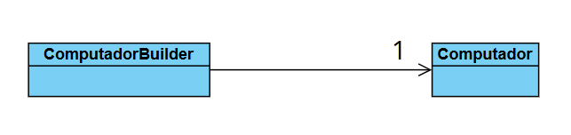

# Padrão de Criação Builder: Configuração de Computadores

Este projeto é um exemplo prático da implementação do **Padrão de Projeto Builder** (Construtor) em Java. O objetivo é demonstrar como construir objetos complexos passo a passo, garantindo que a criação seja segura e que as regras de negócio para campos obrigatórios sejam respeitadas.

## Padrão Utilizado: Builder

O padrão Builder é especialmente útil quando um objeto:
1.  Possui uma grande quantidade de atributos.
2.  Tem atributos obrigatórios e opcionais.
3.  Requer uma validação complexa antes de ser considerado "pronto".

No nosso exemplo, o objeto `Computador` pode ser configurado com muitos componentes (processador, memória RAM, placa de vídeo, etc.), mas Processador e Memória RAM são considerados obrigatórios.

## Estrutura do Projeto

O exemplo é composto por duas classes principais:

### 1. `Computador.java` (Produto)
-   Representa o objeto complexo que está sendo construído.
-   Contém todos os atributos (obrigatórios e opcionais) e seus *getters* e *setters*.

### 2. `ComputadorBuilder.java` (Builder Concreto)
-   É o construtor responsável por montar o objeto `Computador`.
-   Mantém uma referência interna ao objeto `Computador`.
-   Oferece métodos de configuração (e.g., `setProcessador()`, `setMemoriaRAM()`) que retornam a própria instância do Builder, permitindo o encadeamento de chamadas.
-   Possui o método **`build()`**, que realiza as **validações** e retorna a instância final do `Computador`.

## Diagrama de Classes

